# Ultrapolis press kit

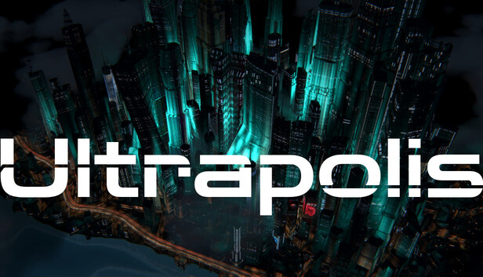

**Ultrapolis is a cyberpunk city diorama with millions of possible buildings. No city management between you and pure layout and design.**

Everything here is free to use in coverage of Ultrapolis. Download the whole kit: Ultrapolis_PressKit.zip.

## Factsheet

| | |
| --- | --- |
| Title | Ultrapolis |
| Developer and publisher | mflux |
| Platform | Windows (Steam) |
| Release date | To be announced |
| Genre | City diorama, sandbox (Casual, Indie, Simulation on Steam) |
| Steam | [store.steampowered.com/app/5314650/Ultrapolis](https://store.steampowered.com/app/5314650/Ultrapolis/) |
| Contact | [flux.blackcat@gmail.com](mailto:flux.blackcat@gmail.com) |
| X | [@mflux](https://x.com/mflux) |
| Instagram | [@procedurallygenerated](https://www.instagram.com/procedurallygenerated/) |
| TikTok | [@mfluxcreations](https://www.tiktok.com/@mfluxcreations) |
| YouTube | [@mflux](https://www.youtube.com/@mflux) |

## About the game

Ultrapolis is a city diorama game inspired by the cityscapes of 90s anime such as Ghost in the Shell and Akira.

### The city is your paintbrush

"Densify" a region and buildings rise, with streets appearing automatically to form a layout. Push it further and towers begin to form.

### Millions of possibilities

Each and every building is procedurally generated and unique to the space it is given. Architecture reacts to the surrounding infrastructure.

- Sky bridges form between buildings on their own.
- Pushed to the limit, buildings combine into superstructures.

### Place the infrastructure

- Elevated highways carve canyons through the dense urban jungle.
- Rail lines bore holes directly through skyscrapers.
- Wide boulevards, canals, and raised decks that lift a whole district to give you a terrace to paint on.

## Videos

| File | Format | Length | What it shows |
| --- | --- | --- | --- |
| [ultrapolis_reveal_trailer_16x9.mp4](videos/ultrapolis_reveal_trailer_16x9.mp4) | 1920x1080, H.264 | 64 s | The reveal trailer |
| [ultrapolis_container_port_9x16.mp4](videos/ultrapolis_container_port_9x16.mp4) | 1080x1920, H.264 | 31 s | How a container port is generated, step by step |
| [ultrapolis_fictional_script_9x16.mp4](videos/ultrapolis_fictional_script_9x16.mp4) | 1080x1920, H.264 | 32 s | Inventing the fictional writing system on the city's neon signs |

## Screenshots

All from the current build (October 2026). Click one for the full-size file.

### Gameplay (1920x1080, HUD shown)

[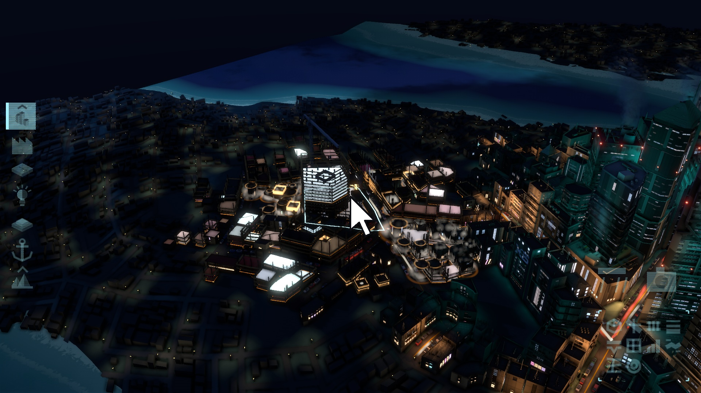](images/gameplay/ultrapolis_gameplay_01.jpg)
[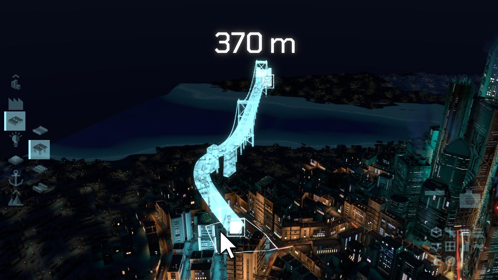](images/gameplay/ultrapolis_gameplay_02.jpg)
[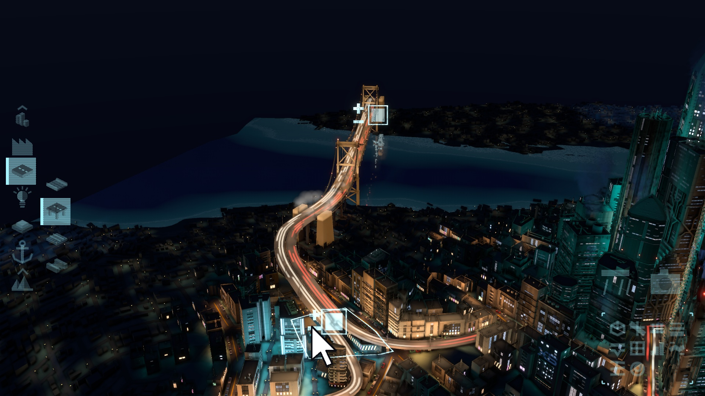](images/gameplay/ultrapolis_gameplay_03.jpg)
[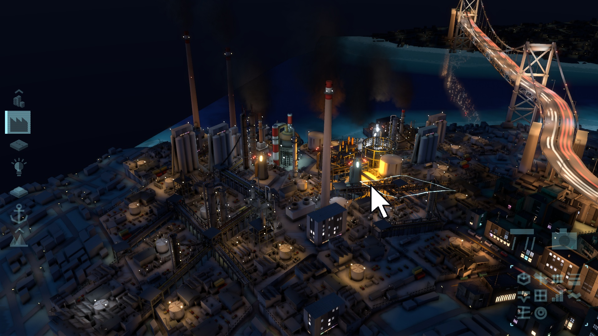](images/gameplay/ultrapolis_gameplay_04.jpg)

### City views (1920x1080, no HUD)

[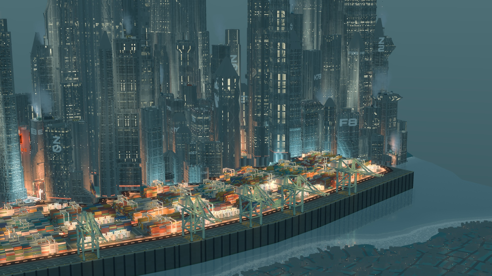](images/cinematic/ultrapolis_screenshot_01_port_skyline.jpg)
[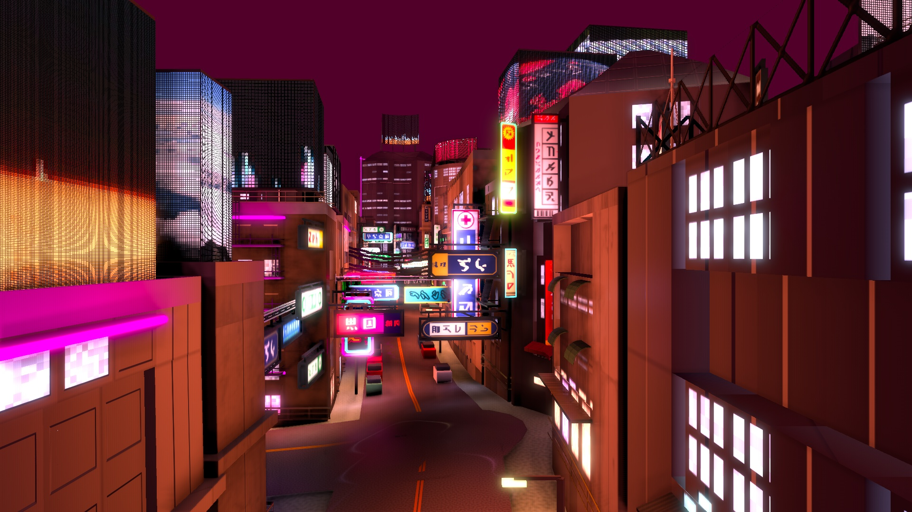](images/cinematic/ultrapolis_screenshot_02_signs_street.jpg)
[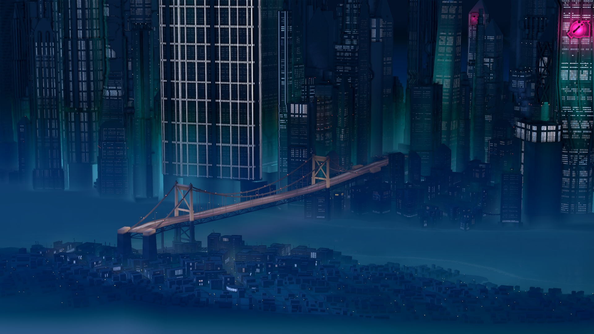](images/cinematic/ultrapolis_screenshot_03_bridge_night.jpg)
[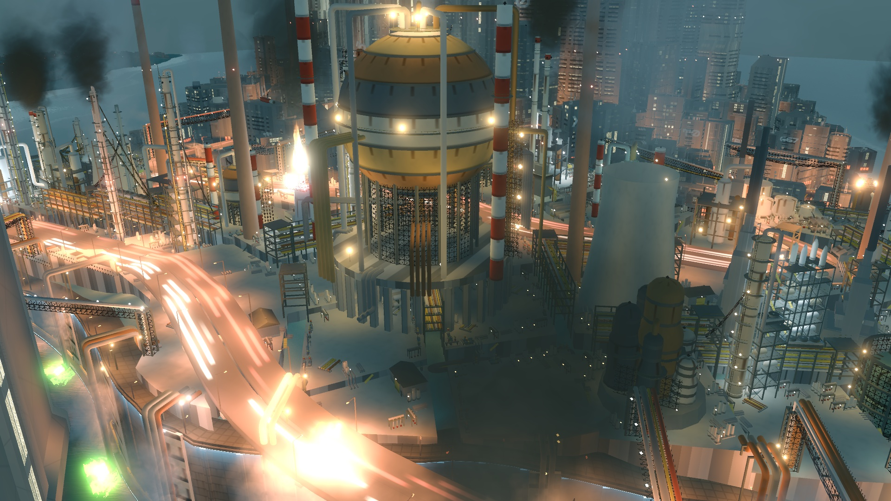](images/cinematic/ultrapolis_screenshot_04_refinery.jpg)
[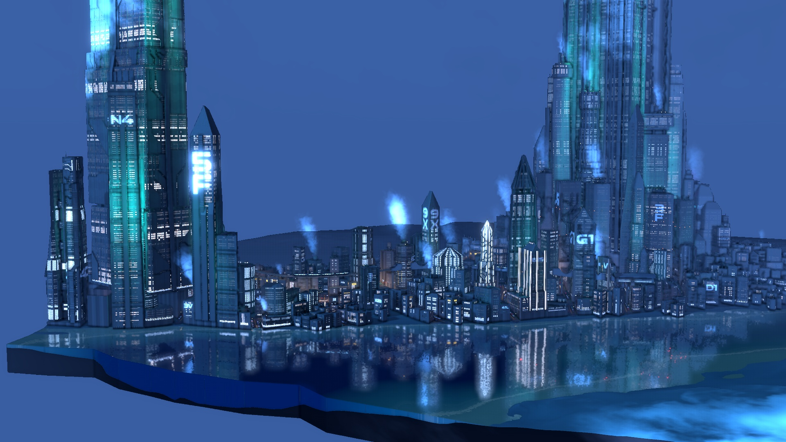](images/cinematic/ultrapolis_screenshot_05_riverfront.jpg)
[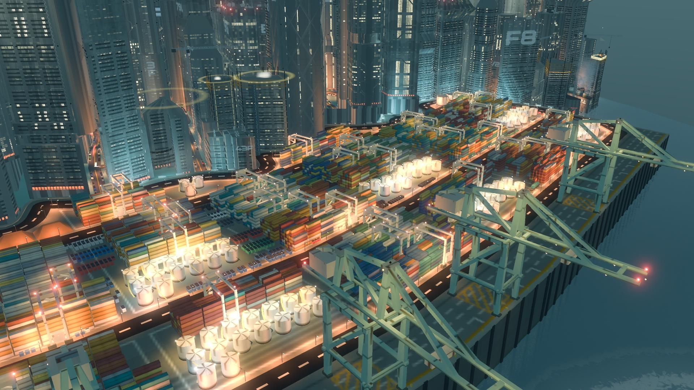](images/cinematic/ultrapolis_screenshot_06_port_close.jpg)

### Vertical (1080x1920, for stories and carousels)

The same city under five of the game's colour looks.

[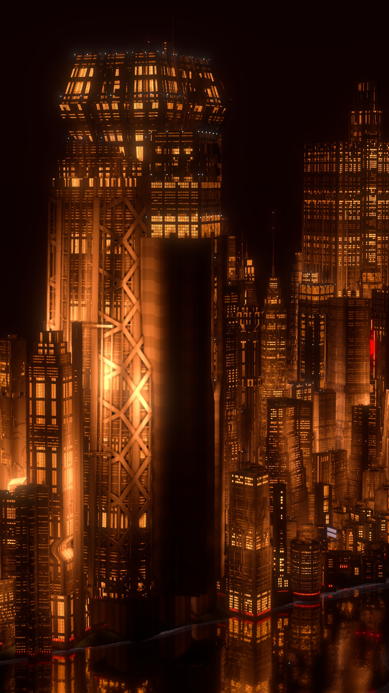](images/vertical/ultrapolis_vertical_01_akira.jpg)
[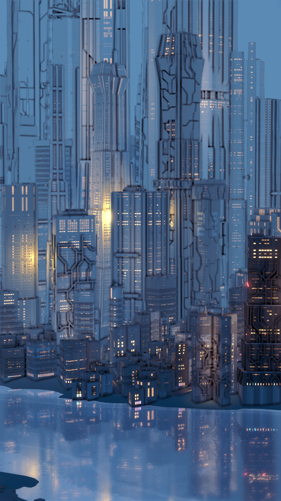](images/vertical/ultrapolis_vertical_02_fog_blue.jpg)
[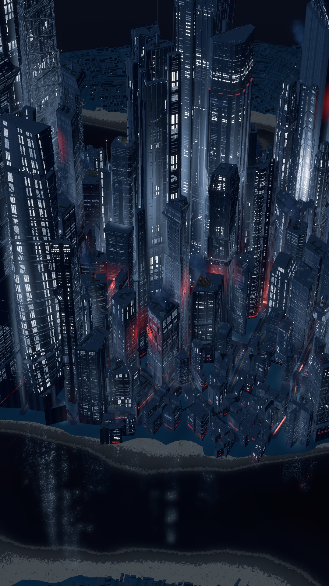](images/vertical/ultrapolis_vertical_03_navy.jpg)
[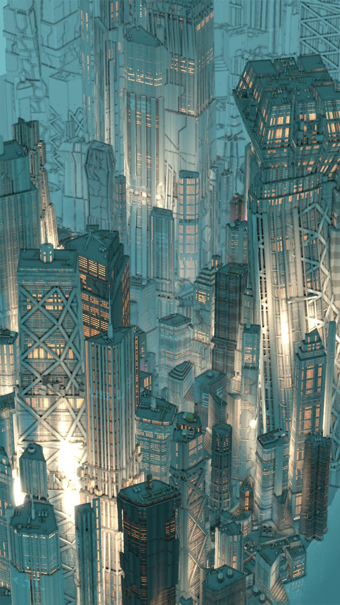](images/vertical/ultrapolis_vertical_04_teal_dusk.jpg)
[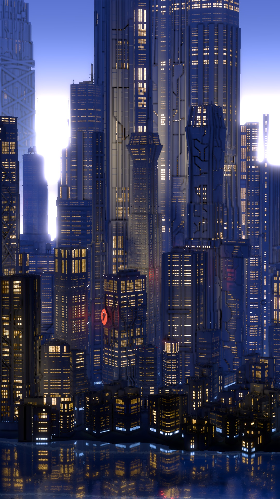](images/vertical/ultrapolis_vertical_05_violet.jpg)

## Logo and capsule art

- [ultrapolis_capsule_616x353.jpg](images/ultrapolis_capsule_616x353.jpg)
- [ultrapolis_header_460x215.jpg](images/ultrapolis_header_460x215.jpg)
